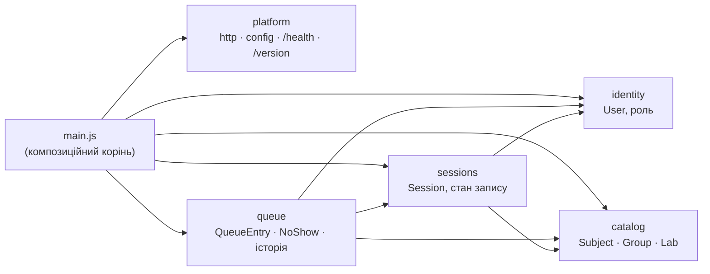
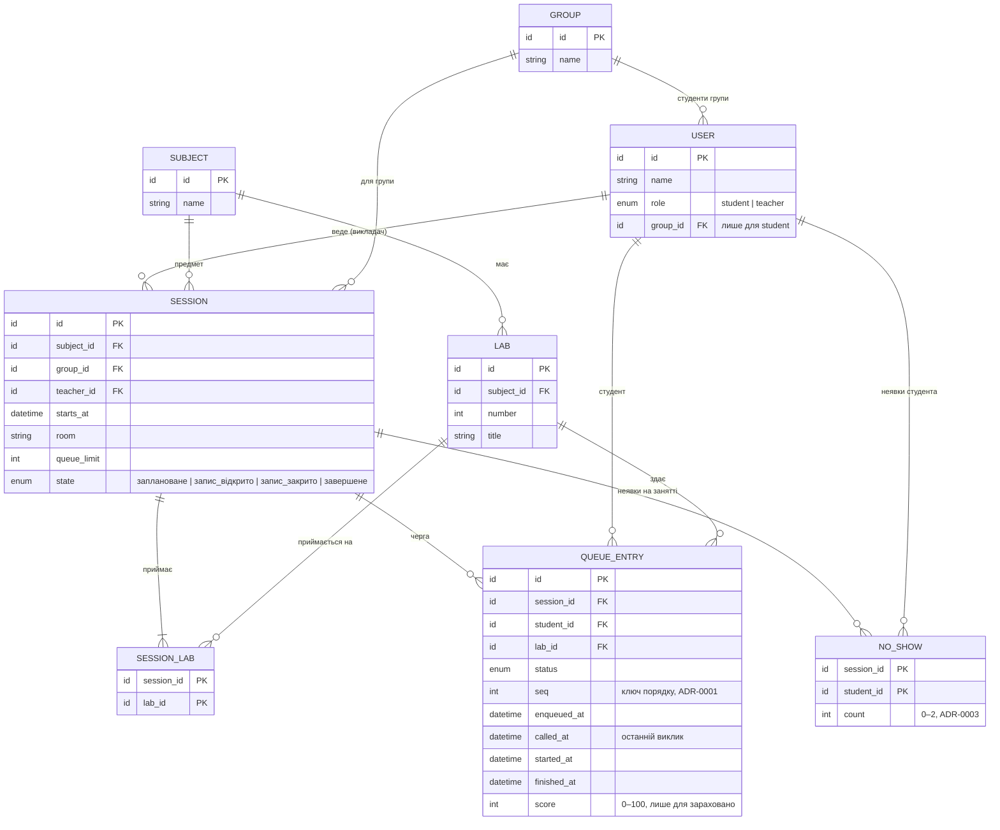
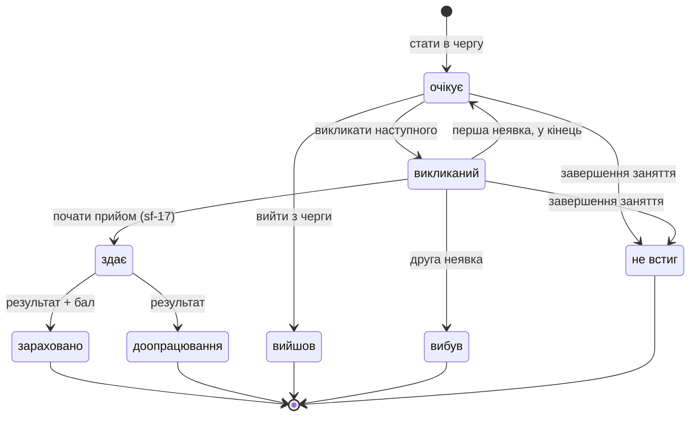
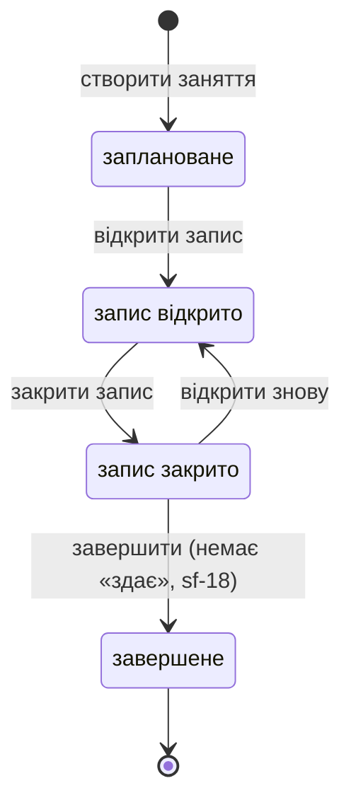

# Архітектура LabQueue

Обов'язковий додаток до [spec.md](spec.md) (sf-1). Спершу — функціонал і
правила черги. З них виведено модулі, напрями залежностей, дані, стани й
сценарії. Рішення з альтернативами — в [docs/adr/](../../adr/).

## Що вміє продукт

Реалізація починається з лаби 2. Перелік потрібен, щоб вивести з нього модулі
й дані.

**Викладач**
- Створює заняття: предмет, група, дата й час, аудиторія, ліміт черги, які
  лаби приймаються. Одне заняття — одна група, потоки поза межами (sf-8).
- Відкриває й закриває запис у чергу; завершує заняття.
- Викликає наступного студента.
- Починає прийом, коли викликаний студент підійшов (sf-17).
- Фіксує результат здачі: «зараховано» з балом (ціле 0–100) або
  «на доопрацювання» (sf-8).
- Позначає, що студент не підійшов.

**Студент**
- Бачить заняття своєї групи й стан їхніх черг.
- Стає в чергу з конкретною лабою: один запис — одна лаба (sf-8). Бачить свою
  позицію й орієнтовний час.
- Виходить із черги.
- Переглядає історію своїх здач.

## Правила черги

**Запис і позиції**
- Активний запис — у статусі «очікує», «викликаний» або «здає» (sf-8). Один
  студент — щонайбільше один активний запис на заняття.
- Нові записи стають у кінець. Позиція є лише в записів «очікує» (sf-8).
  Позиції завжди йдуть підряд, без дірок.
- Запис неможливий у чотирьох випадках (sf-8):
  - запис на заняття закритий;
  - ліміт вичерпано;
  - лаба не приймається;
  - студент на цьому занятті вже «вибув».
- Ліміт рахує активні записи зараз. Перенесення в кінець ліміт не змінює (sf-8).
- Повторний запис після «вийшов» або «доопрацювання» можливий лише в кінець,
  лічильник неявок при цьому зберігається (sf-8).

**Виклик і неявка**
- У викладача одночасно не більше одного запису в «викликаний» або «здає».
  Наступного можна викликати лише після результату або неявки (sf-8).
- Перехід «викликаний → здає» робить викладач дією «почати прийом» (sf-17).
- Неявка фіксується лише з «викликаний» (sf-8):
  - перша — запис повертається в «очікує» в кінець черги;
  - друга — «вибув».
- Лічильник неявок ведеться на пару (студент, заняття), а не на запис (sf-8).

**Заняття**
- Керує заняттям лише викладач, що його створив.
- Завершення заняття переводить усі «очікує» й «викликаний» у «не встиг» (sf-8).
- Завершити заняття можна, лише коли немає запису «здає». Спершу викладач
  фіксує результат (sf-18).
- Орієнтовний час = позиція × середня тривалість останніх здач на цьому
  занятті. Поки здач немає — 10 хв (sf-8).
  - **Тривалість здачі** — від останнього виклику до фіксації результату (sf-19).
  - **Вибірка** — останні 5 записів із результатом («зараховано» або
    «доопрацювання») на цьому занятті. Неявки у вибірку не входять (sf-19).

**Статуси запису** (sf-8)
- `очікує → викликаний → здає → зараховано | доопрацювання`
- `очікує → вийшов`
- `викликаний → очікує` (перша неявка) `| вибув` (друга неявка)
- `очікує | викликаний → не встиг` (завершення заняття)

Неявка — подія, а не статус: вона лише збільшує лічильник і переводить запис
з «викликаний» в «очікує» або «вибув» (sf-13).

Переходу `викликаний → вийшов` у MVP немає свідомо (sf-13). Інакше студент,
якого вже викликали, міг би вийти замість неявки, а потім стати в чергу знову.
Так правило неявок обходилося б виходом.

**Стани заняття** (sf-8)
- `заплановане → запис відкрито ⇄ запис закрито → завершене`
- Закритий запис можна знову відкрити. «Завершене» — кінцевий стан.

## Модулі

Межі проведено за тим, **хто змінює дані і як часто**, а не за технічними
шарами. Кожен доменний модуль — папка `src/modules/<назва>/` з однією
публічною точкою входу `index.js`. Вона дає дві речі:
- **API для інших модулів** — функції;
- **Fastify-плагін з маршрутами модуля.** Інкапсуляція плагінів повторює межі
  модулів.

Решта файлів модуля — внутрішні.

| Модуль | Відповідальність | Дані | Чому межа тут |
|---|---|---|---|
| `platform` (не домен) | HTTP-сервер Fastify, конфіг (`PORT`), логер, `GET /health`, `GET /version` | — | Технічна основа, однакова для будь-якого домену. Домен про неї не знає, тому її можна замінити чи тестувати окремо |
| `identity` | Хто робить запит і яка в нього роль. У MVP — із заголовка, пізніше — справжня автентифікація | `User` (роль, група студента) | Спосіб автентифікації зміниться, а решта домену не повинна цього відчути. Тому ідентичність ізольована за одним API |
| `catalog` | Довідники: предмети, групи, лаби | `Subject`, `Group`, `Lab` | Дані змінюються рідко і не залежать від занять. Їх читають усі, а змінює лише адміністрування |
| `sessions` | Заняття: створення, стан запису (відкрито/закрито), завершення, право власника-викладача, які лаби приймаються | `Session`, `SessionLab` | Стан заняття — окремий життєвий цикл. Черга лише питає «чи можна стати в чергу» і не змінює налаштувань заняття |
| `queue` | Записи в черзі, позиції, виклик, прийом, результат, неявки, ліміт, орієнтовний час, історія здач. Координує завершення заняття | `QueueEntry`, `NoShow` | Ядро з найсуворішими інваріантами (I1–I10). Усі зміни записів проходять через одне місце, і його можна серіалізувати ([ADR-0002](../../adr/0002-zakhyst-vid-honky-zapysiv.md)) |

Композиційний корінь `src/main.js`:
- створює сервер через `platform`;
- реєструє плагіни модулів;
- передає модулям залежності: конфіг і механізм серіалізації.

Модулі не створюють одне одного самі.

**Завершення заняття координує `queue`.** Перевірити «немає запису «здає»» і
перевести записи в «не встиг» може лише власник записів. Тому сценарій
завершення живе в `queue`, а `sessions` дає йому лише перехід стану заняття.
Навпаки не можна: `sessions → queue` утворило б цикл.

**Історія здач — запит у `queue`**, а не окремий модуль
([ADR-0004](../../adr/0004-istoriia-zdach-u-queue.md)).

## Напрями залежностей

Стрілка «A → B» означає, що A імпортує `B/index.js`. Ця таблиця — джерело
правил для dependency-cruiser (CHK-04).

| Хто | Може імпортувати | Чому |
|---|---|---|
| `main.js` | `platform`, усі модулі | Лише він знає всю збірку |
| `queue` | `sessions`, `catalog`, `identity` | Для запису потрібні стан і ліміт заняття, лаба й студент |
| `sessions` | `catalog`, `identity` | Заняття посилається на предмет, групу, лаби й викладача |
| `catalog` | — | Довідники ні від чого не залежать |
| `identity` | — | Ідентичність — лист графа. Групу студента зберігає як id, без імпорту `catalog` |
| `platform` | — (лише npm-пакети) | Технічна основа не знає домену |

**Заборонено** — кожне порушення валить `make check`:
1. **Імпорт в обхід `index.js`** будь-якого модуля, наприклад
   `modules/sessions/internal.js` із `queue`.
2. **Цикли** між модулями і всередині модуля.
3. **Напрям, якого немає в таблиці**, наприклад `sessions → queue` чи
   `catalog → sessions`.
4. **Імпорт з домену в `platform/**` або `main.js`.** Домен отримує все, що
   йому потрібно, як параметри від `main.js`.
5. **Імпорт з `platform` у модулі.**
6. **Спільні таблиці.** Модуль читає чужі дані лише через API модуля-власника,
   напряму — ніколи. Між модулями дані передаються як id.

## Дані (ER)

Кожна сутність має одного власника. Посилання між модулями — лише за id.

| Сутність | Власник | Примітка |
|---|---|---|
| `User` | `identity` | роль `student` або `teacher`; `group_id` є лише у студента |
| `Group`, `Subject`, `Lab` | `catalog` | лаба належить предмету |
| `Session`, `SessionLab` | `sessions` | одне заняття — одна група (sf-8) |
| `QueueEntry` | `queue` | один запис — одна лаба. **Позиція не зберігається**: це ранг серед «очікує» за `seq` ([ADR-0001](../../adr/0001-model-pozytsii-v-cherzi.md)) |
| `NoShow` | `queue` | лічильник на пару (студент, заняття), живе довше за окремий запис ([ADR-0003](../../adr/0003-lichylnyk-neiavok.md)) |

## Інваріанти

Сценарії нижче посилаються на ці ідентифікатори.

- **I1.** У студента щонайбільше один активний запис («очікує», «викликаний»,
  «здає») на заняття.
- **I2.** Активних записів на занятті не більше `queue_limit`. Перевіряється при
  записі в чергу. Перенесення в кінець кількість не змінює.
- **I3.** Позиції записів «очікує» йдуть підряд від 1 у порядку `seq`. Інші
  статуси позиції не мають.
- **I4.** У викладача одночасно не більше одного запису в «викликаний» або
  «здає» (на всіх його заняттях).
- **I5.** Статус змінюється лише за діаграмою станів. Кінцеві статуси не
  змінюються.
- **I6.** Стати в чергу можна за п'яти умов:
  - заняття в стані «запис відкрито»;
  - лаба є серед `SessionLab`;
  - студент належить групі заняття;
  - `NoShow.count < 2`;
  - виконано I1 та I2.
- **I7.** `NoShow.count` ∈ {0, 1, 2}. Він лише зростає. Значення 2 ⇔ на цьому
  занятті є запис студента «вибув».
- **I8.** Керувати заняттям і його чергою може лише викладач, що його створив.
- **I9.** Бал є лише в записів «зараховано» і є цілим 0–100.
- **I10.** «Завершене» — кінцевий стан. Завершити можна лише без записів
  «здає». Після завершення активних записів немає.
- **I11.** Студент бачить лише заняття своєї групи й лише власну історію.

## Стани

### QueueEntry

Повторний запис після «вийшов» чи «доопрацювання» створює **новий** запис.
Лічильник неявок береться з `NoShow`, тож повторний запис його не обнуляє.

### Session

## Сценарії

Для кожного сценарію записано:
- **Модулі** — хто бере участь; перший веде сценарій.
- **Змінюється** — які записи змінюються.
- **Інваріанти** — що має втриматись.

Сценарії, що змінюють `QueueEntry` або `NoShow`, виконуються серіалізовано за
ключем «викладач заняття» ([ADR-0002](../../adr/0002-zakhyst-vid-honky-zapysiv.md)).

### S1. Викладач створює заняття
- **Модулі:** `sessions` → `catalog` (предмет, група, лаби існують), `identity`
  (роль `teacher`).
- **Змінюється:** новий `Session` у стані «заплановане» з
  `teacher_id = поточний користувач`, рядки `SessionLab`.
- **Інваріанти:** I8 — власник фіксується тут; лаби належать предмету
  заняття; `queue_limit` > 0.

### S2. Викладач відкриває запис
- **Модулі:** `sessions` → `identity`.
- **Змінюється:** `Session.state`: «заплановане» чи «запис закрито» → «запис
  відкрито».
- **Інваріанти:** I8; I10 — не з «завершене». Серіалізується з S10, щоб запис
  у чергу не бачив напівзмінений стан.

### S3. Викладач закриває запис
- **Модулі:** `sessions` → `identity`.
- **Змінюється:** `Session.state`: «запис відкрито» → «запис закрито». Записи в
  черзі не змінюються: черга продовжує рухатись.
- **Інваріанти:** I8; після коміту S10 відхиляється (I6).

### S4. Викладач завершує заняття
- **Модулі:** `queue` (координує) → `sessions`, `identity`.
- **Змінюється:**
  - усі «очікує» й «викликаний» → «не встиг» (`finished_at`);
  - `Session.state` → «завершене».

  Усе в одній серіалізованій операції.
- **Інваріанти:** I8; I10 — відмова, якщо є «здає»; заняття в стані «запис
  закрито».

### S5. Викладач викликає наступного
- **Модулі:** `queue` → `sessions`, `identity`.
- **Змінюється:** запис «очікує» з найменшим `seq` → «викликаний»,
  `called_at = зараз`.
- **Інваріанти:** I8; I4 — у викладача немає «викликаний»/«здає»; I3 — решта
  позицій зсувається автоматично, бо позиція обчислюється.

### S6. Викладач починає прийом (sf-17)
- **Модулі:** `queue` → `sessions`, `identity`.
- **Змінюється:** «викликаний» → «здає», `started_at = зараз`.
- **Інваріанти:** I8; I5; I4 зберігається, бо той самий запис.

### S7. Викладач фіксує результат
- **Модулі:** `queue` → `sessions`, `identity`.
- **Змінюється:**
  - «здає» → «зараховано» з `score` або «доопрацювання»;
  - `finished_at = зараз`.
- **Інваріанти:** I8; I5; I9. Після цього I4 дозволяє наступний виклик.

### S8. Викладач позначає неявку
- **Модулі:** `queue` → `sessions`, `identity`.
- **Змінюється:** `NoShow.count += 1` для пари (студент, заняття). Якщо рядка
  немає, він створюється зі значенням 1. Далі:
  - якщо `count = 1` — запис → «очікує», `seq = max(seq) + 1` (у кінець);
  - якщо `count = 2` — запис → «вибув», `finished_at = зараз`.
- **Інваріанти:** I8; I5 — лише з «викликаний»; I7; I2 не змінюється, бо запис
  лишається активним або стає кінцевим; I3.

### S9. Студент бачить заняття своєї групи й стан черг
- **Модулі:** `sessions` (список за групою) → `identity`; `queue` дає кількість
  «очікує» й поточного викликаного.
- **Змінюється:** нічого (читання).
- **Інваріанти:** I11.

### S10. Студент стає в чергу
- **Модулі:** `queue` → `sessions` (стан, ліміт, лаби), `identity` (роль, група),
  `catalog` (лаба).
- **Змінюється:** новий `QueueEntry` «очікує» з `seq = max(seq) + 1` і
  `enqueued_at`.
- **Інваріанти:** I6 (разом з I1, I2); I3. Серіалізація гарантує, що два
  одночасні записи не отримають однаковий `seq` і не перевищать ліміт.

### S11. Студент бачить свою позицію й орієнтовний час
- **Модулі:** `queue` → `identity`.
- **Змінюється:** нічого (читання).
- **Обчислення:**
  - позиція = ранг запису серед «очікує» за `seq`;
  - час = позиція × середнє `finished_at − called_at` за останніми 5
    записами з результатом на занятті. Якщо таких записів немає — 10 хв
    (sf-19).
- **Інваріанти:** I3; I11.

### S12. Студент виходить із черги
- **Модулі:** `queue` → `identity`.
- **Змінюється:** «очікує» → «вийшов», `finished_at = зараз`. Позиції інших
  зсуваються автоматично.
- **Інваріанти:** I5 — лише з «очікує» (sf-13); I3. `NoShow` не змінюється.

### S13. Студент переглядає історію здач
- **Модулі:** `queue` → `sessions` (дата, предмет), `catalog` (назва лаби),
  `identity`.
- **Змінюється:** нічого (читання записів «зараховано» й «доопрацювання»).
- **Інваріанти:** I11 ([ADR-0004](../../adr/0004-istoriia-zdach-u-queue.md)).

### Покриття сценаріїв

| Дія з «Що вміє продукт» | Сценарій |
|---|---|
| Викладач створює заняття | S1 |
| Відкриває запис у чергу | S2 |
| Закриває запис у чергу | S3 |
| Завершує заняття | S4 |
| Викликає наступного студента | S5 |
| Починає прийом (sf-17) | S6 |
| Фіксує результат здачі | S7 |
| Позначає, що студент не підійшов | S8 |
| Студент бачить заняття своєї групи й стан черг | S9 |
| Стає в чергу з конкретною лабою | S10 |
| Бачить свою позицію й орієнтовний час | S11 |
| Виходить із черги | S12 |
| Переглядає історію своїх здач | S13 |
